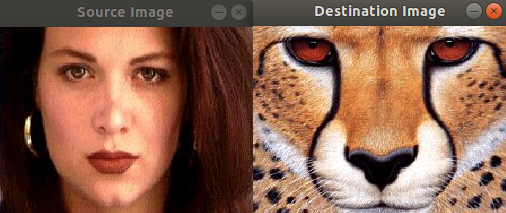
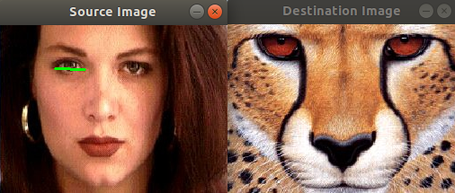
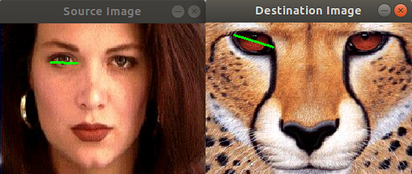
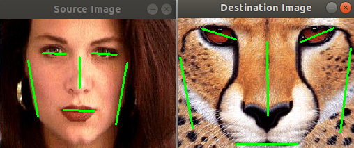
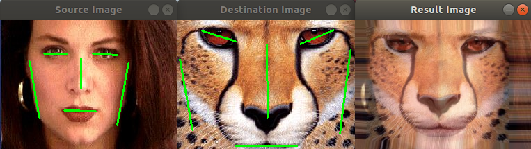

# Image Morphing 

Implement Feature based image morphing algorithm by OpenCV- [Beier–Neely morphing algorithm](https://en.wikipedia.org/wiki/Beier%E2%80%93Neely_morphing_algorithm).

## Environment

* Ubuntu 18.04
* OpenCV 3.4.10 (Reference to setup guide below)

## Compile the program

```
g++ main.cpp -o app `pkg-config --cflags --libs opencv`
```

## Run the program

0. Run the program by providing two images you want to morph between

    ```
    ./app images/women.jpg images/cheetah.jpg
    ```

1. Two images will pop up
   
   

2. Click on "Source Image", press 'a' and drag on the image to draw a feature line (green line)

    

3. Click on "Destination Image", drag on the image to draw a corresponding feature line (green line)

    

4. Repeat steps 2 and 3 to add more feature lines
   
    

5. Press 's' to start warping, an animation will be shown on a third window
   
    

6. Press 's' to watch the animation again or press 'q' to quit the app


## OpenCV setup guide on Ubuntu 18.04

0. Install all of the required libraries
   
    ```
    sudo apt install build-essential cmake pkg-config libgtk-3-dev \
    libavcodec-dev libavformat-dev libswscale-dev libv4l-dev \
    libxvidcore-dev libx264-dev libjpeg-dev libpng-dev libtiff-dev \
    gfortran openexr libatlas-base-dev python3-dev python3-numpy \
    libtbb2 libtbb-dev libdc1394-22-dev
    ```

1. Download OpenCV source code from [here](https://codeload.github.com/opencv/opencv/zip/3.4.10)

2. Unzip and change directory to the unzipped folder ```opencv-3.4.10```

3. Create and enter ```build``` folder

    ```
    mkdir build
    cd build
    ```

4. Generate makefile (in ```build```)

    ```
    cmake ../
    ```

5. Build OpenCV (It will take some time)

    ```
    make
    # Use -j argument to compile using multiple CPUs
    ```

6. Install to system

    ```
    sudo make install
    sudo ldconfig
    ```

7. Check installation

    ```
    pkg-config opencv --modversion
    ```

    It should output
    ```
    3.4.10
    ```